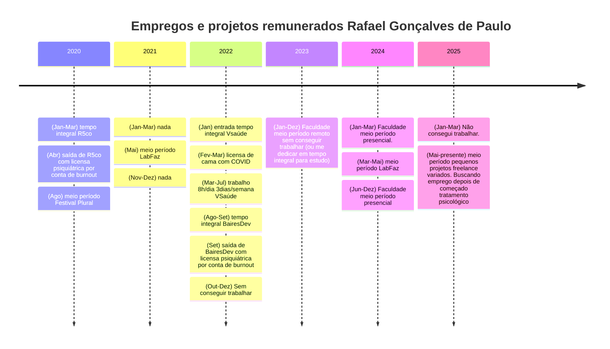

## psico

```mermaid

timeline
    title Empregos e projetos remunerados Rafael Gonçalves de Paulo
    2020 : (Jan-Mar) tempo integral R5co : (Abr) saída de R5co com licensa psiquiátrica por conta de burnout : (Ago) meio período Festival Plural
    2021 : (Jan-Mar) nada : (Mai) meio período LabFaz : (Nov-Dez) nada
    2022 : (Jan) entrada tempo integral Vsaúde : (Fev-Mar) licensa de cama com COVID : (Mar-Jul) trabalho 8h/dia 3dias/semana VSaúde : (Ago-Set) tempo integral BairesDev : (Set) saída de BairesDev com licensa psiquiátrica por conta de burnout : (Out-Dez) Sem conseguir trabalhar
    2023: (Jan-Dez) Faculdade meio período remoto sem conseguir trabalhar (ou me dedicar em tempo integral para estudo)
    2024: (Jan-Mar) Faculdade meio período presencial. : (Mar-Mai) meio período LabFaz : (Jun-Dez) Faculdade meio período presencial
    2025: (Jan-Mar) Não consegui trabalhar. : (Mai-presente) meio período pequenos projetos freelance variados. Buscando emprego depois de começado tratamento psicológico
```
