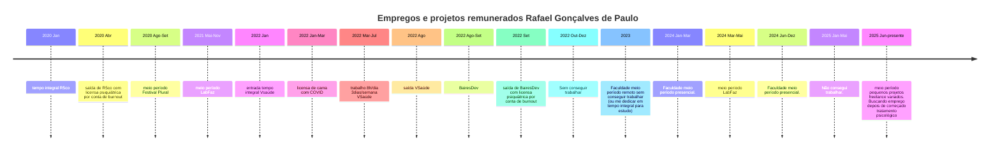
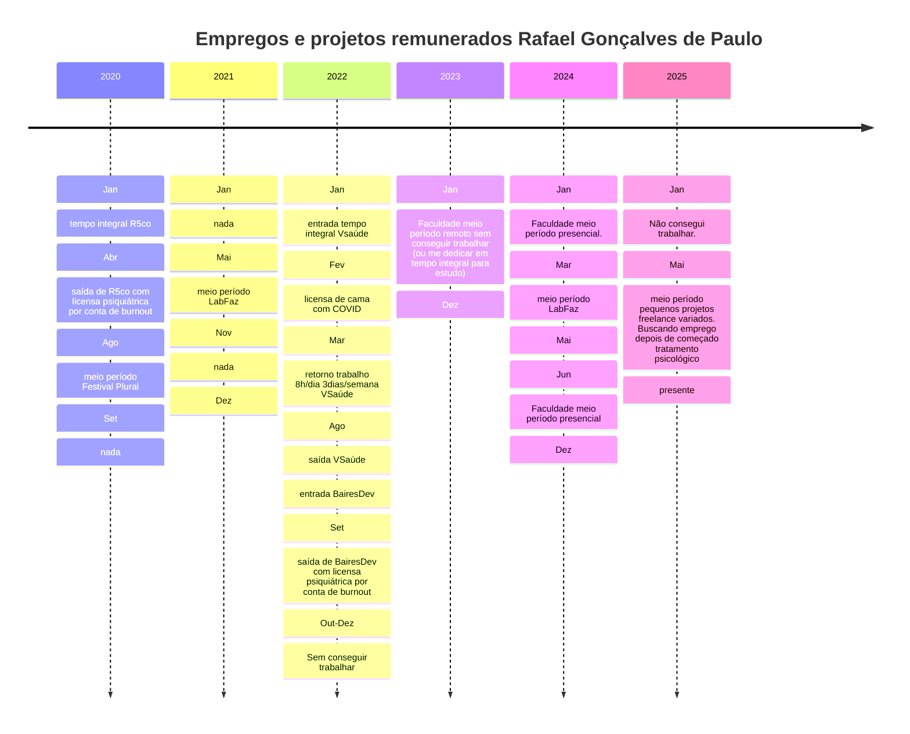
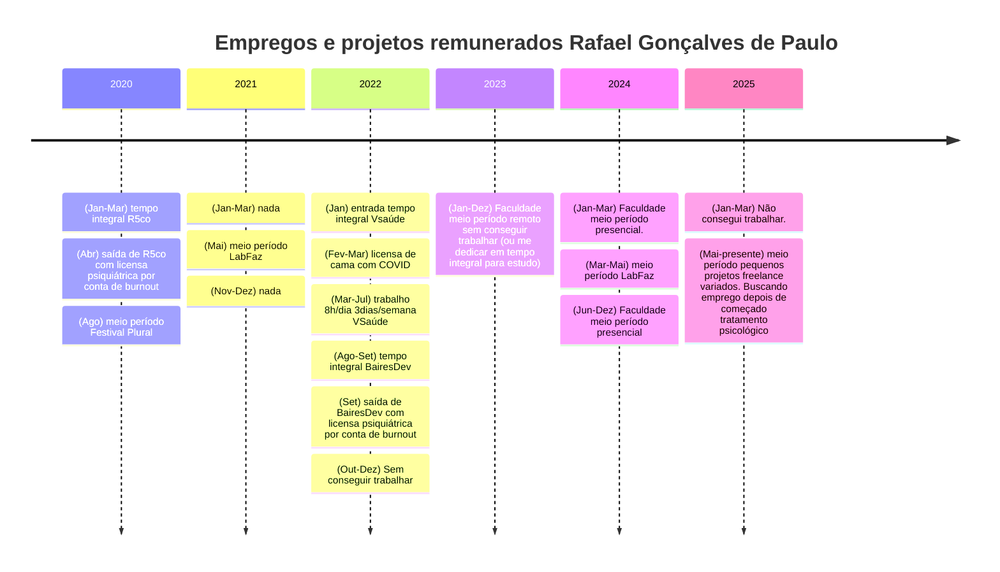

## psico

```mermaid

timeline
    title Empregos e projetos remunerados Rafael Gonçalves de Paulo
    2020 Jan: tempo integral R5co
    2020 Abr: saída de R5co com licensa psiquiátrica por conta de burnout
    2020 Ago-Set: meio período Festival Plural
    2021 Mai-Nov: meio período LabFaz
    2022 Jan: entrada tempo integral Vsaúde
    2022 Jan-Mar: licensa de cama com COVID
    2022 Mar-Jul: trabalho 8h/dia 3dias/semana VSaúde
    2022 Ago: saída VSaúde
    2022 Ago-Set: BairesDev
    2022 Set: saída de BairesDev com licensa psiquiátrica por conta de burnout
    2022 Out-Dez: Sem conseguir trabalhar
    2023: Faculdade meio período remoto sem conseguir trabalhar (ou me dedicar em tempo integral para estudo)
    2024 Jan-Mar: Faculdade meio período presencial.
    2024 Mar-Mai: meio período LabFaz
    2024 Jun-Dez: Faculdade meio período presencial.
    2025 Jan-Mai: Não consegui trabalhar.
    2025 Jun-presente: meio período pequenos projetos freelance variados. Buscando emprego depois de começado tratamento psicológico
```

```mermaid

timeline
    title Empregos e projetos remunerados Rafael Gonçalves de Paulo
    2020 : Jan : tempo integral R5co : Abr : saída de R5co com licensa psiquiátrica por conta de burnout : Ago : meio período Festival Plural : Set : nada    
    2021 : Jan : nada : Mai : meio período LabFaz : Nov : nada : Dez
    2022 : Jan : entrada tempo integral Vsaúde : Fev : licensa de cama com COVID : Mar : retorno trabalho 8h/dia 3dias/semana VSaúde : Ago : saída VSaúde : entrada BairesDev : Set : saída de BairesDev com licensa psiquiátrica por conta de burnout : Out-Dez: Sem conseguir trabalhar
    2023: Jan: Faculdade meio período remoto sem conseguir trabalhar (ou me dedicar em tempo integral para estudo) : Dez
    2024: Jan: Faculdade meio período presencial. : Mar : meio período LabFaz : Mai : Jun : Faculdade meio período presencial : Dez
    2025: Jan: Não consegui trabalhar. : Mai : meio período pequenos projetos freelance variados. Buscando emprego depois de começado tratamento psicológico : presente
```

```mermaid

timeline
    title Empregos e projetos remunerados Rafael Gonçalves de Paulo
    2020 : (Jan-Mar) tempo integral R5co : (Abr) saída de R5co com licensa psiquiátrica por conta de burnout : (Ago) meio período Festival Plural
    2021 : (Jan-Mar) nada : (Mai) meio período LabFaz : (Nov-Dez) nada
    2022 : (Jan) entrada tempo integral Vsaúde : (Fev-Mar) licensa de cama com COVID : (Mar-Jul) trabalho 8h/dia 3dias/semana VSaúde : (Ago-Set) tempo integral BairesDev : (Set) saída de BairesDev com licensa psiquiátrica por conta de burnout : (Out-Dez) Sem conseguir trabalhar
    2023: (Jan-Dez) Faculdade meio período remoto sem conseguir trabalhar (ou me dedicar em tempo integral para estudo)
    2024: (Jan-Mar) Faculdade meio período presencial. : (Mar-Mai) meio período LabFaz : (Jun-Dez) Faculdade meio período presencial
    2025: (Jan-Mar) Não consegui trabalhar. : (Mai-presente) meio período pequenos projetos freelance variados. Buscando emprego depois de começado tratamento psicológico
```

