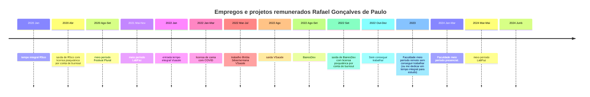

## psico

```mermaid

timeline
    title Empregos e projetos remunerados Rafael Gonçalves de Paulo
    2020 Jan: tempo integral R5co
    2020 Abr: saída de R5co com licensa psiquiátrica por conta de burnout
    2020 Ago-Set: meio período Festival Plural
    2021 Mai-Nov: meio período LabFaz
    2022 Jan: entrada tempo integral Vsaúde
    2022 Jan-Mar: licensa de cama com COVID
    2022 Mar-Jul: trabalho 8h/dia 3dias/semana VSaúde
    2022 Ago: saída VSaúde
    2022 Ago-Set: BairesDev
    2022 Set: saída de BairesDev com licensa psiquiátrica por conta de burnout
    2022 Out-Dez: Sem conseguir trabalhar
    2023: Faculdade meio período remoto sem conseguir trabalhar (ou me dedicar em tempo integral para estudo)
    2024 Jan-Mar: Faculdade meio período presencial.
    2024 Mar-Mai: meio período LabFaz
    2024 Junb
```

