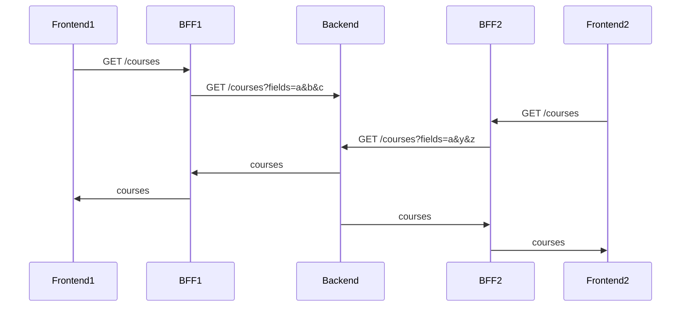

Idea: have a middleware backend for every frontend you have, that works as a cleaner and nicer interface for the real backend services

```mermaid

sequenceDiagram
		participant Frontend1
		participant BFF1
		participant Backend
		participant BFF2
		participant Frontend2

    Frontend1->>BFF1: GET /courses
    BFF1->>Backend: GET /courses?fields=a&b&c
    Frontend2->>BFF2: GET /courses
    BFF2->>Backend: GET /courses?fields=a&y&z
    Backend->>BFF1: courses
    BFF1->>Frontend1: courses
    Backend->>BFF2: courses
    BFF2->>Frontend2: courses
```
