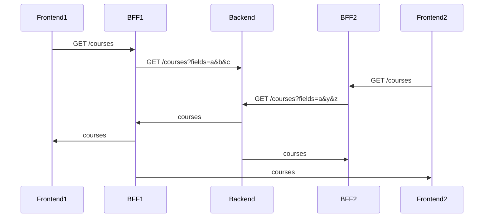

Mermaid is a cool tool thing to make diagrams. it has integration with obsidian so it's really practical.

Ex: sequence diagram:

```mermaid

sequenceDiagram
		participant Frontend1
		participant BFF1
		participant Backend
		participant BFF2
		participant Frontend2

    Frontend1->>BFF1: GET /courses
    BFF1->>Backend: GET /courses?fields=a&b&c
    Frontend2->>BFF2: GET /courses
    BFF2->>Backend: GET /courses?fields=a&y&z
    Backend->>BFF1: courses
    BFF1->>Frontend1: courses
    Backend->>BFF2: courses
    BFF1->>Frontend2: courses
```
