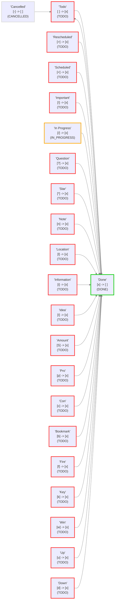

# Review and check your Statuses

## About this file

This file was created by the Obsidian Tasks plugin (version 7.22.0) to help visualise the task statuses in this vault.

If you change the Tasks status settings, you can get an updated report by:

- Going to `Settings` -> `Tasks`.
- Clicking on `Review and check your Statuses`.

You can delete this file any time.

## Status Settings

<!--
Switch to Live Preview or Reading Mode to see the table.
If there are any Markdown formatting characters in status names, such as '*' or '_',
Obsidian may only render the table correctly in Reading Mode.
-->

These are the status values in the Core and Custom statuses sections.

| Status Symbol | Next Status Symbol | Status Name | Status Type | Problems (if any) |
| ----- | ----- | ----- | ----- | ----- |
| `space` | `x` | Todo | `TODO` |  |
| `x` | `space` | Done | `DONE` |  |
| `space` | `x` | Unchecked | `TODO` | Duplicate symbol '`space`': this status will be ignored. |
| `x` | `space` | Checked | `DONE` | Duplicate symbol '`x`': this status will be ignored. |
| `>` | `x` | Rescheduled | `TODO` |  |
| `<` | `x` | Scheduled | `TODO` |  |
| `!` | `x` | Important | `TODO` |  |
| `-` | `space` | Cancelled | `CANCELLED` |  |
| `/` | `x` | In Progress | `IN_PROGRESS` |  |
| `?` | `x` | Question | `TODO` |  |
| `*` | `x` | Star | `TODO` |  |
| `n` | `x` | Note | `TODO` |  |
| `l` | `x` | Location | `TODO` |  |
| `i` | `x` | Information | `TODO` |  |
| `I` | `x` | Idea | `TODO` |  |
| `S` | `x` | Amount | `TODO` |  |
| `p` | `x` | Pro | `TODO` |  |
| `c` | `x` | Con | `TODO` |  |
| `b` | `x` | Bookmark | `TODO` |  |
| `f` | `x` | Fire | `TODO` |  |
| `k` | `x` | Key | `TODO` |  |
| `w` | `x` | Win | `TODO` |  |
| `u` | `x` | Up | `TODO` |  |
| `d` | `x` | Down | `TODO` |  |

## Loaded Settings

<!-- Switch to Live Preview or Reading Mode to see the diagram. -->

These are the settings actually used by Tasks.




## Sample Tasks

Here is one example task line for each of the statuses actually used by tasks, for you to experiment with.

The status symbols and names in the task descriptions were correct when this file was created.

If you have modified the sample tasks since they were created, you can see the current status types and names in the group headings in the Tasks search below.

> [!Tip] Tip: If all your checkboxes look the same...
> If all the checkboxes look the same in Reading Mode or Live Preview, see [Style custom statuses](https://publish.obsidian.md/tasks/How+To/Style+custom+statuses) for how to select a theme or CSS snippet to style your statuses.

- [ ] Sample task 1: status symbol=`space` status name='Todo'
- [x] Sample task 2: status symbol=`x` status name='Done'
- [>] Sample task 3: status symbol=`>` status name='Rescheduled'
- [<] Sample task 4: status symbol=`<` status name='Scheduled'
- [!] Sample task 5: status symbol=`!` status name='Important'
- [-] Sample task 6: status symbol=`-` status name='Cancelled'
- [/] Sample task 7: status symbol=`/` status name='In Progress'
- [?] Sample task 8: status symbol=`?` status name='Question'
- [*] Sample task 9: status symbol=`*` status name='Star'
- [n] Sample task 10: status symbol=`n` status name='Note'
- [l] Sample task 11: status symbol=`l` status name='Location'
- [i] Sample task 12: status symbol=`i` status name='Information'
- [I] Sample task 13: status symbol=`I` status name='Idea'
- [S] Sample task 14: status symbol=`S` status name='Amount'
- [p] Sample task 15: status symbol=`p` status name='Pro'
- [c] Sample task 16: status symbol=`c` status name='Con'
- [b] Sample task 17: status symbol=`b` status name='Bookmark'
- [f] Sample task 18: status symbol=`f` status name='Fire'
- [k] Sample task 19: status symbol=`k` status name='Key'
- [w] Sample task 20: status symbol=`w` status name='Win'
- [u] Sample task 21: status symbol=`u` status name='Up'
- [d] Sample task 22: status symbol=`d` status name='Down'

## Search the Sample Tasks

This Tasks search shows all the tasks in this file, grouped by their status type and status name.

```tasks
path includes {{query.file.path}}
group by status.type
group by status.name
sort by function task.lineNumber
hide postpone button
short mode
```
