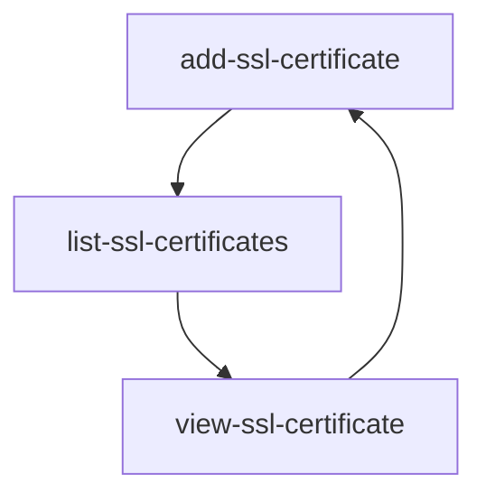

Found this thing while playing around with the web app:

![[Pasted image 20250825173445.png]]

it would have a better UX with a different message. Something like "No actions related to this resource yet.", indicating that you don't *create* and action, but that you do something and the action will show up here.

---

Also in the docs the next page flow of SSL certificates has a mistake. it goes in the following cycle

---

`team-memberships` doesn't have a pretty title. it's because the same folder in the docs doesn't have an `index.md`. example from another folder that has one:
![[Pasted image 20250825175241.png]]

Also **team-memberships** is already a subfolder under `environments`, with a single doc about adding a member to a team. this subfolder should just be deleted and the relevant doc added to the existing `team-membership` folder. `team-membership` already has a **"Add team membership"** doc, though, so it should be reviewed which duplicate should stay.

---

`teams/invitations/add-invitation` links to the previously mentioned `environments/team-memberships/add-team-membership`

---

`teams/members` is empty.

---

**Pro** plan is called **Standard** in `users/subscriptions`

--- 

`variables/add-variable` links to `applications/link-server-to-application` as the next doc. pretty sure it should go to `variables/edit-variable`. Also `variables/remove-variable` should probably link to the next section `virtual-hosts`, not back to the start of the section with `variables/add-variable`

---

`webhooks` index page doesn't have cards with the section's focuses like other sections have (e.g.: `virtual-hosts/`).