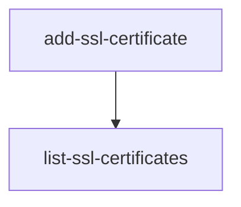

Found this thing while playing around with the web app:
![[Pasted image 20250825173445.png]]

it would have a better UX with a different message. Something like "No actions related to this resource yet.", indicating that you don't *create* and action, but that you do something and the action will show up here.

Also in the docs the next page flow of SSL certificates has a mistake. it goes

